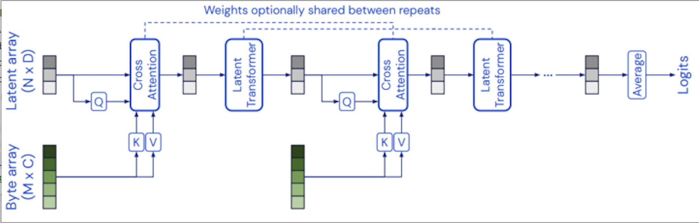
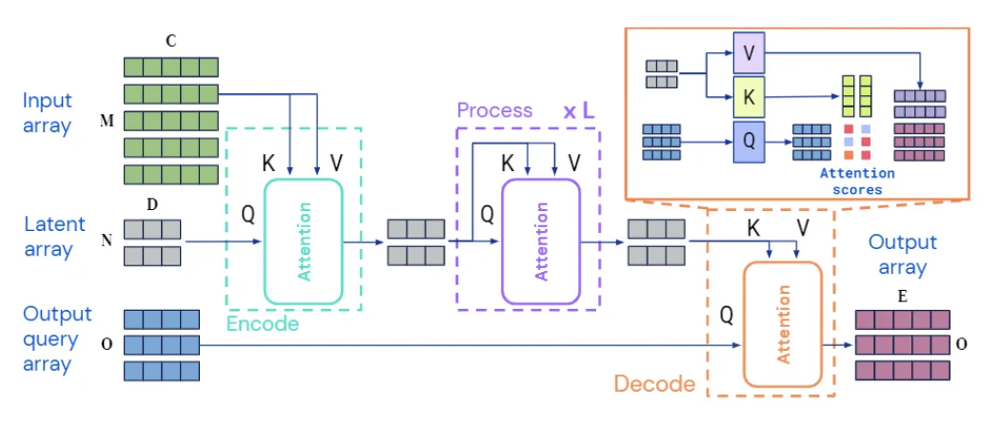
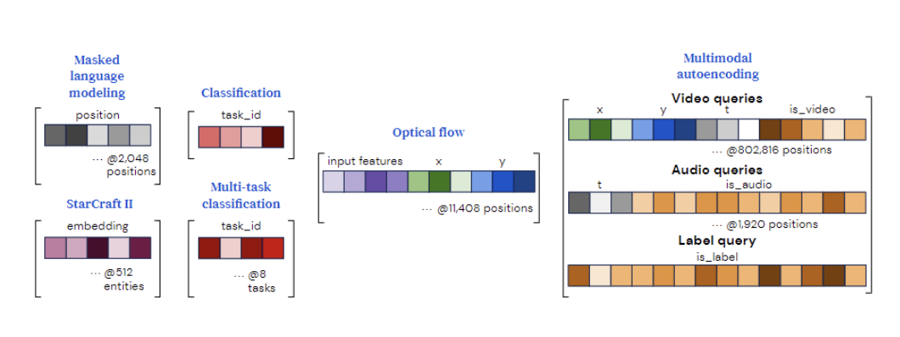
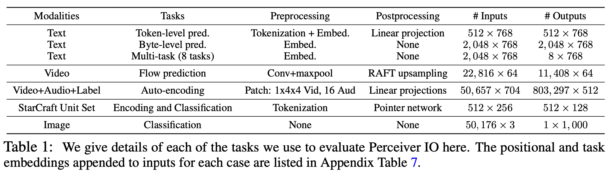
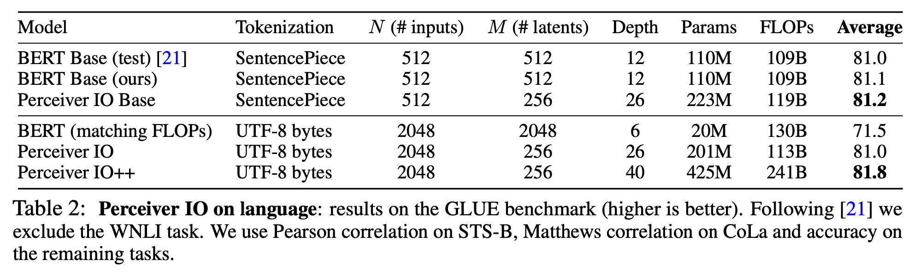

# PERCEIVER IO: A GENERAL ARCHITECTURE FOR STRUCTURED INPUTS & OUTPUTS

# Qustion!
Imagine you're trying to build a neural network that can understand both text and images. How do you handle input data and select models?

What if you also want your network to be able to handle audio, video, and other types of data?

# Overview

## Problem
- Current neural network architectures are designed for specific types of data
- Researchers struggle to handle inputs and outputs of different sizes and formats
- This limitation makes it difficult to build complicated neural pipelines

## Why It's Important
- Real-world data can be messy and unpredictable
- Being able to handle any type of input or output is important for many applications
- Many machine learning models are built to handle single-modality problems, which are specific inputs and outputs related to a single task. This creates complexity as input and output become more diverse.
- A single neural network model that can handle various input patterns and output tasks would simplify model development significantly

## Solution
- Perceiver IO achieves this by augmenting the Perceiver with a flexible querying mechanism that enables outputs of various sizes and semantics, doing away with the need for task-specific architecture engineering. 

## Conclusion
- Perceiver IO offers a promising solution for handling general-purpose inputs and outputs, and multimodal problems without specific preprocessing of a certain mode.

## Video of Overview
[Link to Video](video.mov)

# Architecture  overview
## Perceiver Architecture

- The Perceiver architecture is a combination of a transformer and an MLP (multi-layer perceptron). 
  - It uses self-attention to process inputs and generate outputs. 
  - The transformer part handles global interactions between inputs
  - The MLP part handles local interactions
- The Perceiver architecture uses cross-attention mechanisms to convert multi-modal data (byte arrays) input into a fixed-size latent space, separating network processing from input size and modality-specific details and enabling scaling to large multi-modal datasets. (Processing is cheap and doesn't depend on the input size. This makes it possible to build very deep networks even when using large inputs like images or videos.)
- However, Perceivers have a limitation in handling complex tasks beyond simple outputs such as classification due to their small output size, therefore, it is not a truly general multi-modal model.

## The Perceiver IO Architecture

- The first step involves input encoding, processing, and decoding. 
  - Each module uses a global query-key-value (QKV) attention operation followed by a multi-layer perceptron (MLP). 
  - Both the encoder and decoder accept two input matrices, with the first used as the input to the key and value networks of the module, and the second used as the input to the module's query network. 
  - The output of the module has the same index dimension as the query input (i.e., the same number of elements), which is why the encoder and decoder modules can produce outputs of different sizes.

- The second step is to decode the representation vectors in the latent space, with the goal of generating an output matrix of size O x E given a latent representation of size N x D. 
  - This means that the query information should reflect the downstream task and be able to capture any structure required in the output, including spatial location in images or position of output tokens in sequences.
  - Queries are constructed by combining (concatenating or adding) a set of vectors into a single query vector, which contains all the information relevant to one of the O expected outputs. For tasks with simple outputs, such as classification, these queries can be reused across examples and learned from scratch. 
    - For outputs with spatial or sequential structure, additional position encoding is included to represent the position to be decoded in the output. 
    - For outputs with multi-task or multi-modal structure, learning individual queries for each task or modality allows the network to differentiate one task or modality query from another, just as position encoding allows attention to distinguish between one position and another.

## Experiment

- To evaluate the generality of Perceiver IO, researchers tested it on various tasks in multiple domains and data types, including:
  - language understanding (masked language modeling and downstream task fine-tuning), visual understanding (optical flow and image classification), game symbol representation (Starcraft II), and multi-modal and multi-task settings.
- Result shows that Perceiver IO has achieved excellent results on tasks with highly structured output spaces, 

- Perceiver IO can achieve results comparable to BERT on the GLUE benchmark without requiring tokenization, and has reached state-of-the-art performance on Sintel optical flow estimation task.

## Differencce: Previous vs Perceiver IO
- Perceiver IO overcomes the limitation of the original Perceiver which can only produce very simple outputs such as class scores. It learns to flexibly query the model’s latent space to produce outputs of arbitrary size and semantics.
- Perceiver IO includes a mechanism to directly decode structured outputs (text, video, audio, symbol sets, etc.) from the Perceiver's latent space, allowing it to handle a wide range of new data types. 
- The computational complexity of Perceiver IO is linear in the input and output size and the bulk of the processing occurs in the latent space, allowing us to process inputs and outputs that are much larger than can be handled by standard Transformers.

## Differencce: Perceiver IO vs Transformer
- Transformer has poor scalability in terms of computation and memory. 
  - It requires deploying attention modules throughout its entire architecture, generating queries and keys using its entire input at each layer. 
  - This means that each layer has a quadratic time complexity in terms of computation and memory, making it impossible to train on long input data like images without pre-processing.

- Perceiver IO uses attention in a non-uniform manner。
  - This architecture has no quadratic time complexity dependency on input or output size, as the encoder and decoder attention modules are linearly dependent on input and output size, while the hidden attention is independent of input and output size. 
  - Furthermore, this architecture requires less computation and memory and can scale to larger inputs and outputs.

- While Transformer is typically used for input and output dimensions of up to a few thousand, this new model has shown good results on data with input and output dimensions in the tens of thousands.

## Conclusion

- Perceiver IO extends the Perceiver architecture with a flexible querying mechanism
- This mechanism allows the network to generate outputs of various sizes and semantics, without requiring task-specific engineering
- It scales linearly with input and output sizes, making it easy to use in a wide range of applications and domains
- This architecture has achieved promising results in diverse environments and has the potential to become a candidate model for universal neural network architecture.

# Critical Analysis - What could have been developed further?
- Perceiver IO does not currently support sequential data, such as time series. Addressing this limitation and scaling to even larger inputs is an important direction for future work.
- While Perceiver IO achieves strong results on a wide range of tasks, it may not always outperform task-specific architectures that are designed for a particular domain or task.
- No solution for generative modeling and latent space size adjustment mechanism.
- Model may be subject to biases in large datasets and lack robustness for domain transfer or adversarial attacks, so caution is necessary in safety-critical applications.

# Code demonstration
See [demo](demo-code.ipynb).

# Resource links
1. [Paper](https://arxiv.org/abs/2107.14795)
2. [Perceiver: General Perception with Iterative Attention](https://arxiv.org/abs/2103.03206)
3. [Official GitHub](https://github.com/deepmind/deepmind-research/tree/master/perceiver)
4. [Official Blog](https://www.deepmind.com/blog/building-architectures-that-can-handle-the-worlds-data)
5. [Paperswithcode.com: related infomation collection](https://paperswithcode.com/paper/perceiver-io-a-general-architecture-for#code)
6. [Blog: Perceiver IO: A General Architecture for Structured Inputs & Outputs by Deepmind. Explained!](https://medium.com/analytics-vidhya/perceiver-io-a-general-architecture-for-structured-inputs-outputs-4ad669315e7f)
7. [Video: Stanford Seminar - DeepMind's Perceiver and Perceiver IO: new data family architecture](https://www.youtube.com/watch?app=desktop&v=wTZ3o36lXoQ)
8. [Video: Perceiver IO: A General Architecture for Structured Inputs & Outputs - Paper Explained!](https://www.youtube.com/watch?v=AS1Sh-KuNzs)
